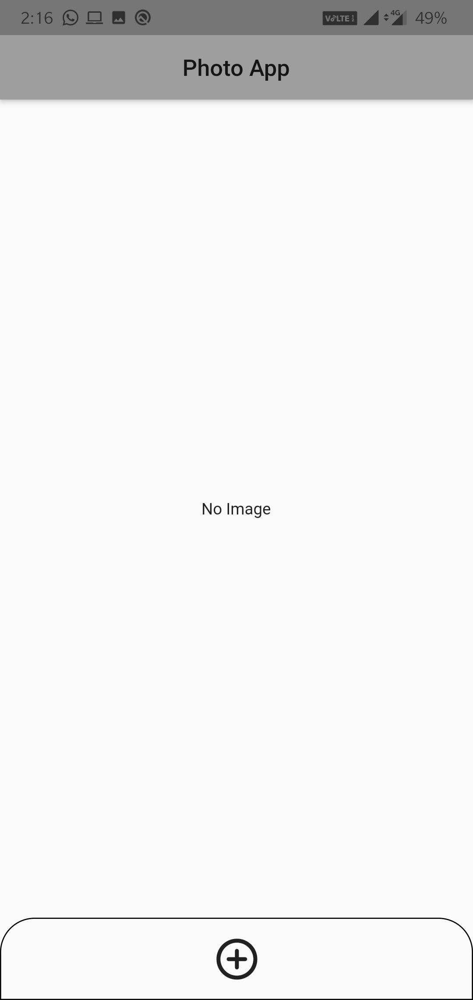
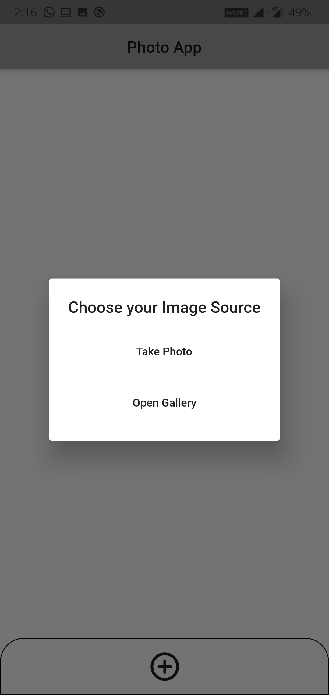
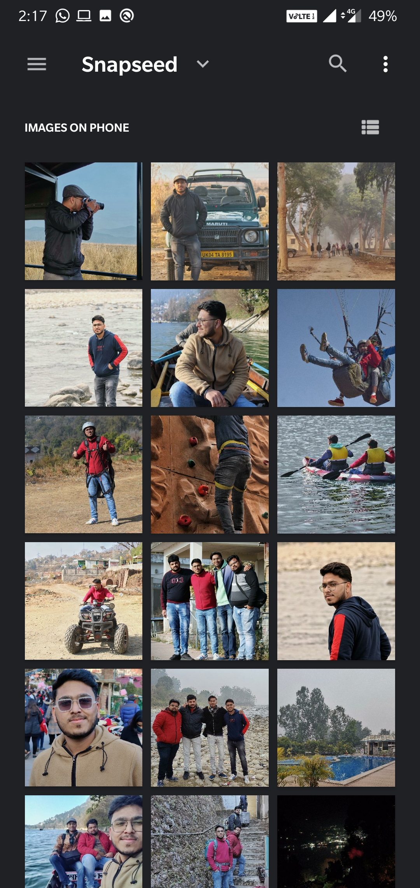
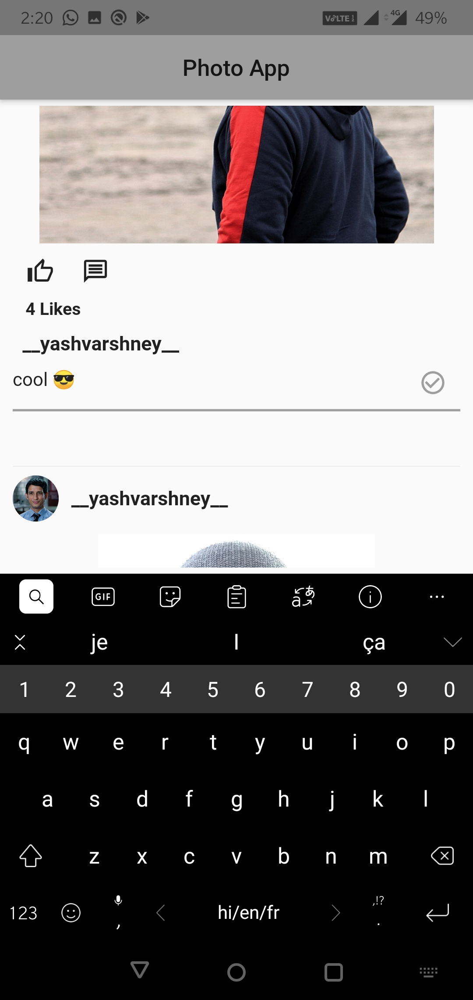
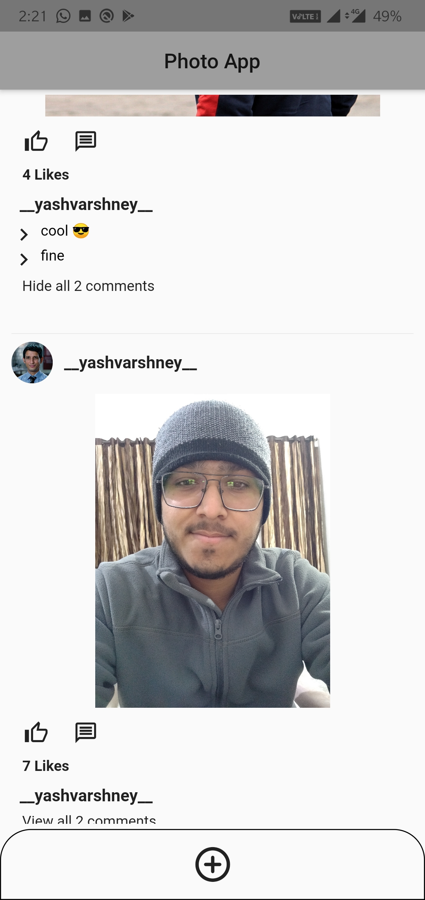

# Photo App

I made this Photo App as a Pre-Interview Assignment. 
**Release Apk** : https://drive.google.com/drive/folders/1cZipz5PDBT_9hY_xwBfvOcQN1i4raDi4?usp=sharing
 

**What is it doing?** 
It is a one-page app with a bottom navigation bar. User can select a file in the gallery, or take a new picture to upload. Using Hive to store details like local photo location, the number of reactions, comments, and the actual comment text.
  
**What is Hive?** 
NoSql Lightweight Offline Database

- database (We can store data using this)
- NoSQL (doesn't use sql, saves data in key-value pair)
- Offline (Stores data in local storage)

# Screenshots :

&nbsp;&nbsp;&nbsp;
&nbsp;&nbsp;&nbsp;
 
&nbsp;&nbsp;&nbsp;
&nbsp;&nbsp;&nbsp;
 

  

My Profiles :

- [LinkedIn](https://www.linkedin.com/in/yash-varshney/)
- [Codeforces](https://codeforces.com/profile/__ykji)
